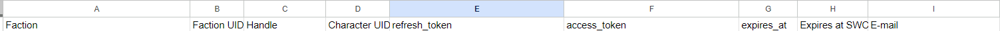
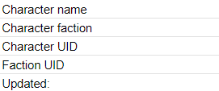

# SWC OAuth in GAS

This repository contains basic files for using the Star Wars Combine Web Services in a Google Apps Script environment, such as Google Sheets.

## Deployment

You will need to add these scopes to your worksheet's apssscript.json:

```
"oauthScopes":[
  "https://www.googleapis.com/auth/userinfo.email",
  "https://www.googleapis.com/auth/script.container.ui",
  "https://www.googleapis.com/auth/script.external_request",
  "https://www.googleapis.com/auth/spreadsheets.currentonly"
]
```

When deploying to your system, first get your redirect uri by running the associated function. Then, after registering your new app, fill in the remaining 'XXX' values in Secrets.js file that you build from Secrets.example.js.

Set up a tab ‘Accounts’ with these columns:



Make sure you set these columns as text! Google likes to perform math with UIDs.

Set up a tab Character Profile with these named fields for the 'active user' (and label them). This is not a requirement for your projects, but rather allows you to check basic functionality.

 `<br/>`
_SWC_CharName `<br/>`
_SWC_FactionName `<br/>`
_SWC_CharUID `<br/>`
_SWC_FactionUID `<br/>`
_SWC_ProfileUpdate `<br/>`
